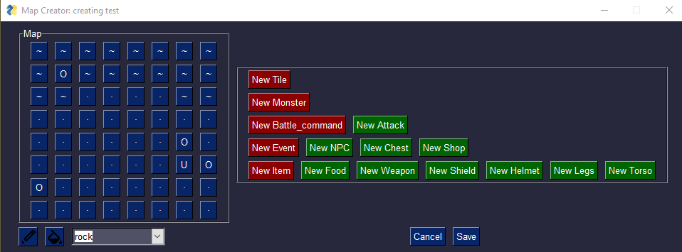

# goby-map-editor
Create map/game data for goby projects, inspired by the issue: https://github.com/nskins/goby/issues/82 

## Requirements
\>= Python 3.6  
Tkinter (apt install python-tk if running it doesn't work immediately)

## My hare-brained scheme
This project massively takes advantage of Python's metaprogramming features.  Rather than hard-coding anything, the program reads class data from 'objects.py,' such as class attributes and even what class(es) any given class may inherit from and creates windows where an instance of the class may have its attributes filled out.  All super dynamic.  When creating an object instance, anything left blank will be populated with the class's default parameter for that attribute.   
  
Each class instance is required to have a 'nickname' when being created.  My hope was that when the resulting data gets read in to Goby, it could be used as a key in a map, or something.  Maybe if I went the route of converting the yaml files into actual runnable Ruby constructor calls, they could be variable names. I don't know.  Much like this program, I work very much on-the-fly.

*A very crude interface from a very crude programmer*

## Making Changes
First I strongly recommend perusing the Goby source.  It's not complex so you should be able to get a confidently strong idea of what's going on in an hour or two.  The code under /lib/goby is what we'll be targeting

This program works by reading all the member values of any given class (from my source code, not Goby's :P, future implementation idea, perhaps?), then generates data fields which will be used to populate a new instance of that object.  Making this generic was the best thing I could do to make any future changes to goby as easy as possible, since as soon as the program detects a new class in 'objects.py' it creates new buttons and text fields for it.  
  
I am trying to force static typing in this project, since each class has its own data types, and keeping track of what data type goes where is a royal pain with dynamic typing.  Hence why we need Python 3.6 or up.

## Roadmap
- [x] Groundwork (base app, basic text fields, etc)  
- [x] Export data to JSON or YAML (YAML would be preferred) 
- [x] Export map to CSV 
- [ ] Contextual form fields (dropdown for custom game objects, textfield for others)   
    - [x] Textfield forms for most, dropdowns for custom objects
    - [x] Handling of lists (multi-select)
    - [ ] Contextually choose multi-select or dropdown
  - [x] Automatic dropdowns for any instances of created game objects, provided the class exists  
  - [ ] Dictionary support (stats, equipment, etc)
- [ ] Form field validation  
- [x] Support for Item game object  
  - [x] Food
  - [x] Equipment
- [x] Support for default Event game objects
  - [x] Chest  
  - [x] NPC  
  - [x] Shop
- [ ] Edit created object types
- [ ] Open existing files for editing
- [ ] A less cumbersome UX (WIP)
    [x] Click to fill a tile
    [x] Paint bucket option
    [ ] Populate form field options with default params (currently leaving them blank implicitly chooses default param)
- [ ] Better UI (WIP)
    [x] Better color scheme
    [ ] Better-er color scheme
    [ ] Improved layout (I don't know what I want)
